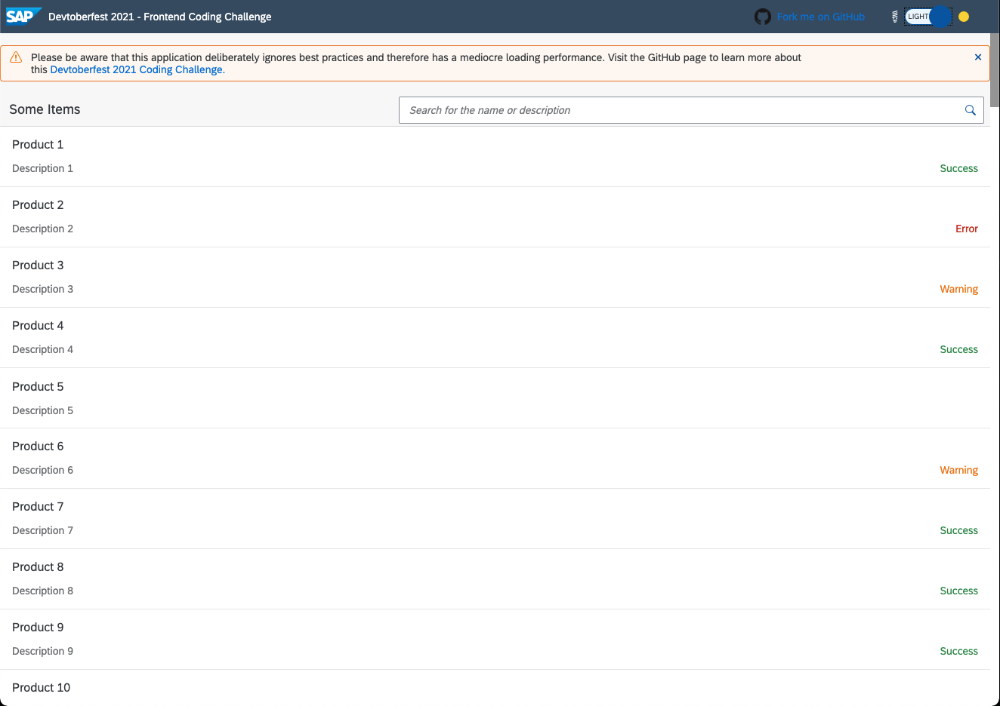

# Devtoberfest 2021 Frontend Week Coding Challenge


[![Build Status][test-image]][test-url]
[![License Status][license-image]][license-url]
[![REUSE status][reuse-image]][reuse-url]

## Description

This is the [Devtoberfest 2021 Coding Challenge of week 6](https://github.com/SAP-samples/devtoberfest-2021/blob/main/topics/Week6_Frontend/README.md#coding-challenge). The repo contains a web application that displays all current services available on the SAP Business Technology Platform. 



Unfortunately, this app doesn't have the best loading performance. The [Lighthouse performance score](https://web.dev/performance-scoring/) is way below 10 out of 100. Luckily, this is not the fault of the used framework but happened due to a bad implementation and disregard of [common best practices](TODO-Insert-Link-to-Video). It's up to you to fix this web application and to push the performance score above 70.

## Requirements

Node.js LTS version 14 is installed: https://nodejs.org/en/download

## Download and Installation

### Getting started

1. Clone this repository and navigate into it
    ```sh
    git clone https://github.com/SAP-samples/devtoberfest-2021-frontend-coding-challenge
    cd devtoberfest-2021-frontend-coding-challenge
    ```
1. Install all dependencies

    ```sh
    npm install
    ```

1. Start a local server and run the application (http://localhost:8080/index.html)
    ```sh
    npm start
    ```

### Testing

Start the [Karma Test Runner](https://karma-runner.github.io/latest/index.html) with the [UI5 Plugin](https://github.com/SAP/karma-ui5) and execute the tests
    ```sh
    npm test
    ```

## How to obtain support

This content is provided "as-is" with no other support.

## Known Issues

This project got a really bad [Lighthouse performance score](https://web.dev/performance-scoring/). As part of this coding challenge, it's up to you to improve this web app.


## Contributing / Submitting your Proposal

You can submit your solution as follows:

1. Fork and clone this repository

1. Install all dependencies

    ```sh
    npm install
    ```

1. Start a local server and run the application (http://localhost:8080/index.html)
    ```sh
    npm start
    ``` 

1. Trigger the [Lighthouse Performance Scoring](https://web.dev/performance-scoring/) (e.g. with [Google Chrome](https://developers.google.com/web/tools/lighthouse))

1. Optimize the app until the performance score is above 70.

1. Commit and push your edits
    ```sh
    git commit -am "Fix performance issues"
    git push
    ```

1. Create a pull request and make sure your web app is exposed as with [GitHub Pages](https://pages.github.com/) and available under `https://${{ github.actor }}.github.io/${{ github.name }}/`. Our CI/CD actions will take it from here and let you know if your app passed the test.

    TODO add screenshot here


> Please note that we won't merge any pull request. It is sufficient if your PR earns the green "passed" label and you entered your SAP Community ID in the pull request **after** the label was assigned. If everthing goes well, your pull request will be closed then.


## License

Copyright (c) 2021 SAP SE or an SAP affiliate company. All rights reserved. This project is licensed under the Apache Software License, version 2.0 except as noted otherwise in the [LICENSE](LICENSES/Apache-2.0.txt) file.


[test-image]: https://github.com/SAP/generator-easy-ui5/actions/workflows/main.yml/badge.svg
[test-url]: https://github.com/SAP/generator-easy-ui5/actions/workflows/main.yml
[daviddm-image]: https://img.shields.io/david/SAP/generator-easy-ui5.svg
[daviddm-url]: https://david-dm.org/SAP/generator-easy-ui5
[license-image]: https://img.shields.io/npm/l/generator-easy-ui5.svg
[license-url]: https://github.com/SAP/generator-easy-ui5/blob/master/LICENSE
[reuse-image]: https://api.reuse.software/badge/github.com/SAP/generator-easy-ui5/
[reuse-url]: https://api.reuse.software/info/github.com/SAP/generator-easy-ui5/