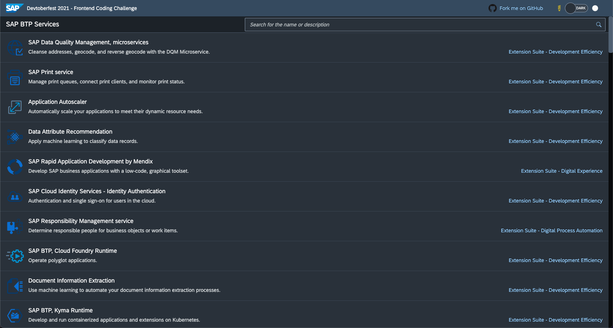

# Devtoberfest 2021 Frontend Week Coding Challenge

[![Build Status][test-image]][test-url]
[![Open in Visual Studio Code][vscode-image]][vscode-url]
[![License Status][license-image]][license-url]
[![REUSE status][reuse-image]][reuse-url]

## Description

This is the [Devtoberfest 2021 Coding Challenge of week 6](https://github.com/SAP-samples/devtoberfest-2021/blob/main/topics/Week6_Frontend/README.md#coding-challenge). The repository contains a [web application](https://sap-samples.github.io/devtoberfest-2021-frontend-coding-challenge/) that displays all current services available on the SAP Business Technology Platform:



Unfortunately, this app doesn't have the best loading performance. The [Lighthouse performance score](https://web.dev/performance-scoring/) is way below the achievable 100 points. Luckily, this is not the fault of the framework used but happened due to a bad implementation and disregard of [common best practices](https://www.youtube.com/watch?v=CBF_8eOjuc8). It’s up to you to fix this web application and to push the performance score above 70.

Possible areas where you can achieve performance boosts are:
- [Optimize Media Files](https://www.youtube.com/watch?v=CBF_8eOjuc8&t=551s)
- [Avoid or Minimize Blocking JS and CSS / On-demand Loading of Assets](https://www.youtube.com/watch?v=CBF_8eOjuc8&t=675s)
- [Reduce the Network Load](https://www.youtube.com/watch?v=CBF_8eOjuc8&t=859s)
- [Reduce the Perceived Loading Time](https://www.youtube.com/watch?v=CBF_8eOjuc8&t=970s)


For more details, watch [this video](https://www.youtube.com/watch?v=CBF_8eOjuc8):


[](https://www.youtube.com/watch?v=CBF_8eOjuc8)

## Requirements

Node.js LTS version 14 is installed: https://nodejs.org/en/download

## Contributing / Submitting your Proposal

You can submit your solution as follows:

1. Fork and clone this repository

1. Turn GitHub Actions on for this repository to allow the included workflows, e.g.,  to build the web app on every push.

1. Turn GitHub Pages on as well to host the improved web app there.

1. Install all dependencies

    ```sh
    npm install
    ```

1. Start a local server and run the application (http://localhost:8080/index.html)

    ```sh
    npm start
    ```

1. Trigger the [Lighthouse Performance Scoring](https://web.dev/performance-scoring/) (e.g. with [Google Chrome](https://developers.google.com/web/tools/lighthouse))

1. Optimize the app until the performance score is above 70.

1. Commit and push your edits

    ```sh
    git commit -am "Fix performance issues"
    git push
    ```

1. Create a pull request and make sure your web app is exposed as with [GitHub Pages](https://pages.github.com/) and available under `https://${{ Your GitHub User }}.github.io/devtoberfest-2021-frontend-coding-challenge/`. Our CI/CD actions will take it from here and let you know if your app passed the test.

    

> In case you still have questions: [Check out this video](https://www.youtube.com/watch?v=CBF_8eOjuc8&t=1292s) where I create an example contribution.

Please note that we won't merge any pull requests. It is sufficient if your PR earns the green "passed" label and you entered your SAP Community ID in the pull request **after** the label was assigned. If everything goes well, your pull request will be closed then.

# Challenge Rules

We don't want to be too prescriptive in this fun challenge, but there are a few things that we need to ask you to do so that things have a chance of running smoothly.

For this challenge, please abide by these rules:

1. You have a week to complete the challenge, i.e. to submit a pull request with your changes. This means that any PR submitted after Saturday 13 Nov will not be considered.
1. Please ensure you specify your SAP Community user name in your pull request (either in the title or when prompted for it after the GitHub Actions passed).
1. You only need to send modifications to the content in the `/docs` and `/webapp` folders and possibly the `package.json`. You should not need to modify any other files in this repository (especially not the `.github` folder).
1. We will not merge your pull request as the base repository remains the starting template for everyone. Instead, we will just judge your submissions based upon what is contained within the pull request.

## Download and Installation

### Getting started

1. Clone this repository and navigate into it
    ```sh
    git clone https://github.com/SAP-samples/devtoberfest-2021-frontend-coding-challenge
    cd devtoberfest-2021-frontend-coding-challenge
    ```
1. Install all dependencies

    ```sh
    npm install
    ```

1. Start a local server and run the application (http://localhost:8080/index.html)
    ```sh
    npm start
    ```

### Testing

Start the [Karma Test Runner](https://karma-runner.github.io/latest/index.html) with the [UI5 Plugin](https://github.com/SAP/karma-ui5) and execute the tests
`sh npm test `

## How to obtain support

This content is provided "as-is" with no other support.

## Known Issues

This project got a terrible [Lighthouse performance score](https://web.dev/performance-scoring/). As part of this coding challenge, it's up to you to improve this web app.

## License

Copyright (c) 2021 SAP SE or an SAP affiliate company. All rights reserved. This project is licensed under the Apache Software License, version 2.0, except as noted otherwise in the [LICENSE](LICENSES/Apache-2.0.txt) file.

[test-image]: https://github.com/SAP-samples/devtoberfest-2021-frontend-coding-challenge/actions/workflows/push.yaml/badge.svg
[test-url]: https://github.com/SAP-samples/devtoberfest-2021-frontend-coding-challenge/actions/workflows/push.yaml
[license-image]: https://img.shields.io/github/license/SAP-samples/devtoberfest-2021-frontend-coding-challenge.svg
[license-url]: https://github.com/SAP-samples/devtoberfest-2021-frontend-coding-challenge/blob/master/LICENSE
[reuse-image]: https://api.reuse.software/badge/github.com/SAP-samples/devtoberfest-2021-frontend-coding-challenge
[reuse-url]: https://api.reuse.software/info/github.com/SAP-samples/devtoberfest-2021-frontend-coding-challenge
[vscode-image]: https://open.vscode.dev/badges/open-in-vscode.svg
[vscode-url]: https://open.vscode.dev/SAP-samples/devtoberfest-2021-frontend-coding-challenge/
